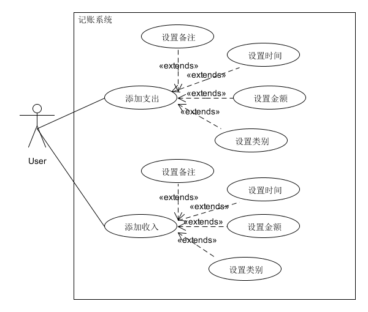
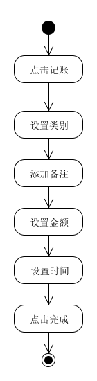
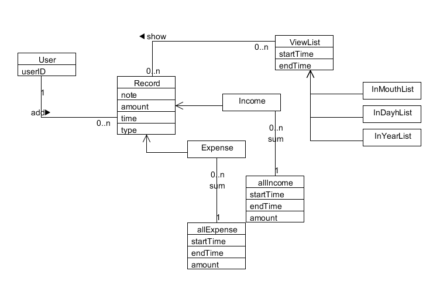
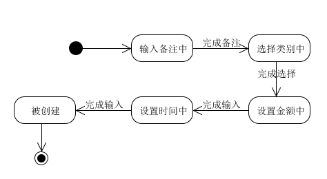
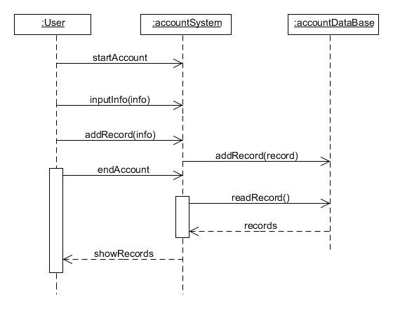

## 系统分析与设计Hw-6

>建模时参考的是**Leader15331019-Jupiter小组**提供的的鲨鱼记账APP的[业务文档](https://jupiter-sysu.github.io/dashboard/10-midterm-practice)

建模如下

### 用例图

### 记账业务的活动图

### 记账用例的领域模型

### 账单记录对象的状态模型

### 记账功能的系统顺序图
